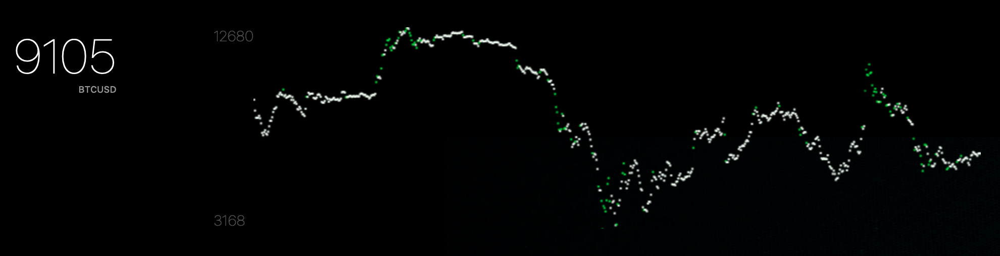

## Kraken Crypto Price & Graph Widget for Übersicht

[http://tracesof.net/uebersicht/](http://tracesof.net/uebersicht/)
[https://www.kraken.com/features/api](https://www.kraken.com/features/api)

A quick view of the current price of your chosen asset pair from Krakens free OHLC API. The graph will display acording to you selected range. Dots get a more prominent color based on their volume; higher volume for that time frame -> brighter color.

Edit to `src/config.js` to set up your widget!

### Installation

1. Download and install Übersicht.
2. Copy and pase this project into your widgets folder.

### TODO

- Re-use data. Let's be friendly to Krakens API
- Actual error handling
- Support for other price APIs
- Support multiple graphs & prices
- Do a better job displaying volume
- More color support

### FAQ

> Where is my graph?

The graph won't be visible for the first refresh cycle, it'll be there soon.
